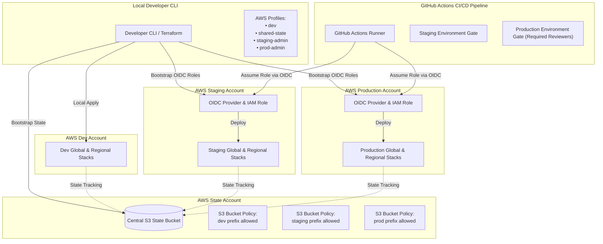
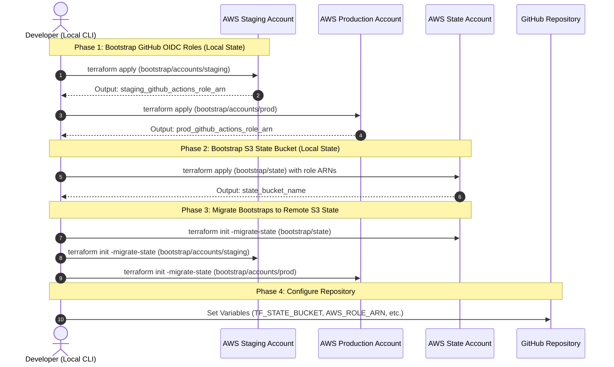

# Production-Ready Multi-Account & Multi-Region Terraform AWS Template

[](https://www.terraform.io/)
[](https://opensource.org/licenses/MIT)

This repository provides an enterprise-grade, highly secure, and battle-tested template for orchestrating multi-account, multi-region AWS infrastructure deployments using Terraform and GitHub Actions. 

By leveraging native AWS OIDC Federation (no persistent access keys), decoupled state backends, parallel multi-regional execution matrices, and push-based environments promotion with required approval gates, this layout scales safely from early-stage startups to mature enterprise deployments.

---

## 🏗️ Architecture Overview

The workspace splits deployments into separate Terraform root modules per environment, partitioned into **global/shared** resources and **regional** application stacks. This separation keeps blast radiuses small, accelerates local CLI testing, and ensures regional deployments run in parallel.



### 📂 Directory Hierarchy

```text
bootstrap/
  state/                    # local-state setup for the shared Terraform state bucket
  accounts/staging/         # local-state setup for the staging GitHub Actions role
  accounts/prod/            # local-state setup for the production GitHub Actions role
  modules/                  # bootstrap-only reusable modules (e.g., github-actions-role)
envs/dev/global/            # local CLI testing for dev shared/global resources
envs/dev/regional/          # local CLI testing for dev regional app resources
envs/staging/global/        # GitHub-deployed staging shared/global resources
envs/staging/regional/      # GitHub-deployed staging regional app resources
envs/prod/global/           # GitHub-deployed production shared/global resources
envs/prod/regional/         # GitHub-deployed production regional app resources
modules/app/                # reusable regional app infrastructure
```

---

## 🛡️ Core Security & Isolation Principles

### 1. Stack Boundaries
- **Global Stacks (`global/`)**: Put resources that are deployed once per environment here. Examples include: **IAM Roles, Route 53 Zones, CloudFront Distributions, Global Accelerator, shared KMS keys**, and general shared configurations.
- **Regional Stacks (`regional/`)**: Put resources that are instantiated once per target AWS region. These call the core application module (`modules/app`). Examples: **VPCs, ECS/EKS clusters, RDS instances, and regional Load Balancers**.
- **State Segregation**: Global and regional stacks use completely separate state keys. This prevents an issue in a regional deploy from corrupting your global state. 

> [!NOTE]
> Always deploy global stacks **first** when regional resources depend on global outputs. When destroying, destroy regional stacks first, then global.

### 2. AWS OIDC Federation (Passwordless CI/CD)
No static AWS credentials or IAM Access Keys are committed or stored in GitHub. GitHub Actions authenticates directly to target AWS accounts via **OpenID Connect (OIDC)**. AWS validates the federated JWT signed by GitHub and issues temporary credentials scoped down to the specific repository, environment, and branch.

### 3. State Bucket Access & Key Segregation
Instead of hosting a state bucket per account, state is consolidated in a central **Shared State Account** state bucket. High-integrity segregation is maintained via S3 prefix-based policies:
- **Dev Account**: Restricted to `example-app/dev/<dev-account-id>/*`.
- **Staging Role**: Restricted to `example-app/staging/*`.
- **Production Role**: Restricted to `example-app/prod/*`.

This multi-tenant structure protects production state from being read or modified by staging pipelines or local developer environments.

---

## ⚙️ Prerequisites

1. **Terraform `>= 1.15`** installed locally and matching the CI/CD pipeline version.
2. **AWS CLI** configured with named profiles matching your target accounts.
3. A **GitHub Repository** created to host this template.
4. Local AWS Config Profiles:
   Configure these in your `~/.aws/config` (or use equivalent profiles):
   - `shared-state` (State-owning AWS account credentials)
   - `staging-admin` (Staging AWS account credentials)
   - `prod-admin` (Production AWS account credentials)
   - `dev` (Local development AWS account credentials)

---

## 🚀 Bootstrap Order

Because remote state buckets and IAM OIDC roles do not exist initially, you must initialize Terraform with local state first, apply the resources, and then migrate those local state files into S3 once the bucket is ready.



### Milestone 1: Create GitHub OIDC Deployment Roles

The OIDC roles must be bootstrapped first. The IAM policies attached to these roles reference the future S3 state bucket ARN before the bucket is even created.

1. **Prepare tfvars files**:
   Copy the example files and replace the placeholder AWS Account IDs, owner, and repository name with your actual values.

   * **Unix / macOS / Git Bash**:
     ```sh
     cp bootstrap/accounts/staging/terraform.tfvars.example bootstrap/accounts/staging/terraform.tfvars
     cp bootstrap/accounts/prod/terraform.tfvars.example bootstrap/accounts/prod/terraform.tfvars
     ```
   * **PowerShell**:
     ```powershell
     Copy-Item bootstrap/accounts/staging/terraform.tfvars.example bootstrap/accounts/staging/terraform.tfvars
     Copy-Item bootstrap/accounts/prod/terraform.tfvars.example bootstrap/accounts/prod/terraform.tfvars
     ```

2. **Deploy Staging OIDC Role**:
   ```sh
   terraform -chdir=bootstrap/accounts/staging init -backend=false
   terraform -chdir=bootstrap/accounts/staging apply
   terraform -chdir=bootstrap/accounts/staging output github_actions_role_arn
   ```

3. **Deploy Production OIDC Role**:
   ```sh
   terraform -chdir=bootstrap/accounts/prod init -backend=false
   terraform -chdir=bootstrap/accounts/prod apply
   terraform -chdir=bootstrap/accounts/prod output github_actions_role_arn
   ```

---

### Milestone 2: Create the Central S3 State Bucket

Next, bootstrap the S3 bucket in the shared state account. You will need to add the dev account ID and the GitHub role ARNs (copied from the outputs above) to the `trusted_state_access` list in `terraform.tfvars` before executing.

1. **Prepare tfvars file**:
   * **Unix / macOS / Git Bash**:
     ```sh
     cp bootstrap/state/terraform.tfvars.example bootstrap/state/terraform.tfvars
     ```
   * **PowerShell**:
     ```powershell
     Copy-Item bootstrap/state/terraform.tfvars.example bootstrap/state/terraform.tfvars
     ```

2. **Edit `bootstrap/state/terraform.tfvars`**:
   Uncomment `trusted_state_access` and paste in your developer accounts and the bootstrapped GitHub OIDC role ARNs.

3. **Deploy S3 State Bucket**:
   ```sh
   terraform -chdir=bootstrap/state init -backend=false
   terraform -chdir=bootstrap/state apply
   terraform -chdir=bootstrap/state output state_bucket_name
   ```

---

### Milestone 3: Migrate Bootstrap Roots to S3 Remote State

Now that the S3 bucket exists, migrate all bootstrap configurations from local `terraform.tfstate` files to S3 remote backends. This ensures that your OIDC roles and state bucket are safely managed, versioned, and shared.

1. **Prepare backend files**:
   Copy the backend template files.

   * **Unix / macOS / Git Bash**:
     ```sh
     cp bootstrap/state/backend.tf.example bootstrap/state/backend.tf
     cp bootstrap/accounts/staging/backend.tf.example bootstrap/accounts/staging/backend.tf
     cp bootstrap/accounts/prod/backend.tf.example bootstrap/accounts/prod/backend.tf
     ```
   * **PowerShell**:
     ```powershell
     Copy-Item bootstrap/state/backend.tf.example bootstrap/state/backend.tf
     Copy-Item bootstrap/accounts/staging/backend.tf.example bootstrap/accounts/staging/backend.tf
     Copy-Item bootstrap/accounts/prod/backend.tf.example bootstrap/accounts/prod/backend.tf
     ```

2. **Configure Backend Settings**:
   Edit each of the newly created `backend.tf` files. Replace the placeholder values (`example-app`, `000000000000`, bucket names, and regions) with your actual configuration details.

3. **Run Migration**:
   Initialize with the `-migrate-state` flag. When prompted, type `yes` to transfer your local state into S3.
   ```sh
   terraform -chdir=bootstrap/state init -migrate-state
   terraform -chdir=bootstrap/accounts/staging init -migrate-state
   terraform -chdir=bootstrap/accounts/prod init -migrate-state
   ```

4. **Verify Plan Integrity**:
   Run a plan on each to verify that Terraform sees absolutely zero pending infrastructure changes:
   ```sh
   terraform -chdir=bootstrap/state plan
   terraform -chdir=bootstrap/accounts/staging plan
   terraform -chdir=bootstrap/accounts/prod plan
   ```

5. **Clean up**:
   Once you verify that plans are completely empty, delete the local `terraform.tfstate` and `terraform.tfstate.backup` files from the bootstrap directories. **Do not commit local `.tfstate` files.**

---

## 💻 Local Development Setup

To test changes locally before pushing, use the local `dev` environment folders.

1. **Copy the Dev configurations**:
   * **Unix / macOS / Git Bash**:
     ```sh
     cp envs/dev/global/terraform.tfvars.example envs/dev/global/terraform.tfvars
     cp envs/dev/global/backend.hcl.example envs/dev/global/backend.hcl
     cp envs/dev/regional/terraform.tfvars.example envs/dev/regional/terraform.tfvars
     cp envs/dev/regional/backend.hcl.example envs/dev/regional/backend.hcl
     ```
   * **PowerShell**:
     ```powershell
     Copy-Item envs/dev/global/terraform.tfvars.example envs/dev/global/terraform.tfvars
     Copy-Item envs/dev/global/backend.hcl.example envs/dev/global/backend.hcl
     Copy-Item envs/dev/regional/terraform.tfvars.example envs/dev/regional/terraform.tfvars
     Copy-Item envs/dev/regional/backend.hcl.example envs/dev/regional/backend.hcl
     ```

2. **Configure Dev Variables (`terraform.tfvars`)**:
   Adjust values to match your local AWS dev account profile and ID:
   ```hcl
   region         = "us-east-1"
   profile        = "dev"
   app_name       = "example-app"
   aws_account_id = "111111111111"
   ```

3. **Configure Dev Backend Settings (`backend.hcl`)**:
   Ensure `profile` is specified, as the S3 backend credentials do not inherit the provider's profile:
   ```hcl
   bucket       = "example-app-terraform-state-000000000000"
   key          = "example-app/dev/111111111111/us-east-1/terraform.tfstate"
   region       = "us-east-1"
   profile      = "dev"
   ```

4. **Deploy Local Dev Stacks**:
   Deploy the global configurations first, followed by the regional infrastructure.
   ```sh
   # Deploy Global first
   terraform -chdir=envs/dev/global init -backend-config backend.hcl
   terraform -chdir=envs/dev/global apply

   # Deploy Regional second
   terraform -chdir=envs/dev/regional init -backend-config backend.hcl
   terraform -chdir=envs/dev/regional apply
   ```

---

## 🚀 GitHub Environments & CI/CD Pipeline

To enable fully automated, push-based promotion pipelines, you must configure target environments inside your GitHub Repository settings.

### 1. Create GitHub Environments
Create two environments named exactly:
- `staging`
- `production`

> [!IMPORTANT]
> **Production Protection Gate**: In your GitHub repository, under `Settings > Environments > production`, enable **Required reviewers** and add your team's approvers. This pauses the promotion sequence after a staging success, preventing unapproved releases from deploying automatically.

### 2. GitHub Actions Variables Reference

Configure these variables within your GitHub repository settings (`Settings > Secrets and variables > Actions > Variables`):

| Variable Name | Scope | Required | Default Value | Description / Notes |
| :--- | :--- | :---: | :--- | :--- |
| `AWS_ACCOUNT_ID` | `staging` & `production` | **Yes** | — | The target AWS Account ID where resources are deployed. |
| `AWS_ROLE_ARN` | `staging` & `production` | **Yes** | — | The AWS IAM Role ARN to assume via OIDC (from bootstrap output). |
| `TF_STATE_BUCKET` | Repository | **Yes** | — | The central S3 bucket hosting all state files. |
| `APP_NAME` | Repository | No | `example-app` | Scaled prefix used to form state keys, OIDC roles, and tag schemes. |
| `AWS_REGION` | Repository | No | `us-east-1` | Default fallback region for regional deployments. |
| `AWS_REGIONS_JSON` | Repository | No | — | JSON list of regions for multi-region matrices (e.g., `["us-east-1", "us-west-2"]`). |
| `TF_GLOBAL_REGION` | Repository | No | — | Provider region for global stacks (e.g., must be `us-east-1` for CloudFront ACM certificates). |
| `TF_STATE_REGION` | Repository | No | `us-east-1` | S3 bucket region. |

### 3. Built-in Maintenance & Security Checks

The template includes low-noise repository maintenance and IaC security checks that work without cloud credentials:

- **Dependabot (`.github/dependabot.yml`)**: Opens grouped weekly pull requests for GitHub Actions and Terraform provider/module updates. Terraform directories use template-friendly glob patterns so newly added environments and modules are picked up automatically.
- **Security Checks (`.github/workflows/security-checks.yml`)**: Runs Trivy IaC scanning on pull requests, pushes to `main`, and manual dispatches. It reports `HIGH` and `CRITICAL` Terraform/IaC misconfigurations in the workflow summary.

Trivy is advisory by default and does not fail CI. This keeps fresh repositories usable during the initial bootstrap phase, where broad deployment permissions may intentionally exist. Once your IAM policies are hardened, change the Trivy `exit-code` from `"0"` to `"1"` if you want high-severity findings to block merges.

---

## 🛠️ Multi-Region Deployment Matrix Details

The deployment pipeline is optimized using standard GitHub Actions matrices:

1. **Validation Checks (`terraform-checks.yml`)**:
   Runs on every Pull Request. It validates code formatting, syntax, and generates dynamic execution plans against the staging environment, writing the `terraform plan` summaries directly back into your Pull Request comments.

2. **Parallel Regional Runs (`terraform-deploy.yml`)**:
   Pushes to `main` initiate the staging lifecycle. Staging `global` deploys first. Once successful, the regional stacks deploy concurrently using a parallel job matrix based on `AWS_REGIONS_JSON`.
   
3. **Environment Isolation**:
   Staging and production state files are fully segregated by account and prefix shape:
   - `example-app/staging/global/terraform.tfstate`
   - `example-app/staging/<region>/terraform.tfstate`
   - `example-app/prod/global/terraform.tfstate`
   - `example-app/prod/<region>/terraform.tfstate`

---

## 🔒 Hardening IAM to Least-Privilege

By default, the bootstrap modules deploy roles with AWS managed `AdministratorAccess` (`bootstrap/modules/github-actions-role/main.tf`). This allows developers to build out initial stacks without running into permission roadblocks. 

For production environments, **least privilege permissions** are highly recommended.

### Steps to Harden Roles:
1. Identify the list of AWS services and specific actions your Terraform stacks require.
2. In `bootstrap/modules/github-actions-role/main.tf`, replace the `AdministratorAccess` entry inside the `policies` map with your own scoped IAM policies.
3. Ensure you preserve the state bucket access policies inside `data.aws_iam_policy_document.github_actions` so Terraform can continue writing remote states.
4. Apply the updated policy securely via local CLI bootstrap directory or PR flow:
   ```sh
   terraform -chdir=bootstrap/accounts/staging apply
   terraform -chdir=bootstrap/accounts/prod apply
   ```

---

## ❓ FAQ & Troubleshooting

### Q1: I get a `SignatureDoesNotMatch` or authentication error when running `init` in CI/CD.
Verify that the `AWS_ROLE_ARN` matches the output of the corresponding environment bootstrap. Ensure the GitHub Repository OIDC provider is configured with the correct repository path (`github_owner/github_repo`). 

### Q2: How do I add a new regional resource?
Add resource files or variables inside `modules/app/`. Since the regional environments (`envs/*/regional/main.tf`) call the `app` module directly, any resources defined there are instantly inherited and deployed across dev, staging, and production regional matrices.

### Q3: How do I deploy a new, custom region?
Simply update the `AWS_REGIONS_JSON` GitHub repository variable to include your new region name (e.g. `["us-east-1", "us-west-2", "eu-west-1"]`). The GitHub workflow matrix will automatically adapt and create a parallel deployment track for it.

### Q4: I need to reset the local bootstrap flow. How can I start over safely?
Do not delete `terraform.tfstate` unless you want to discard your local bootstrap state. Delete the generated `backend.tf` and `.terraform/` folders in the target bootstrap directory, and rerun `terraform init -backend=false`.
